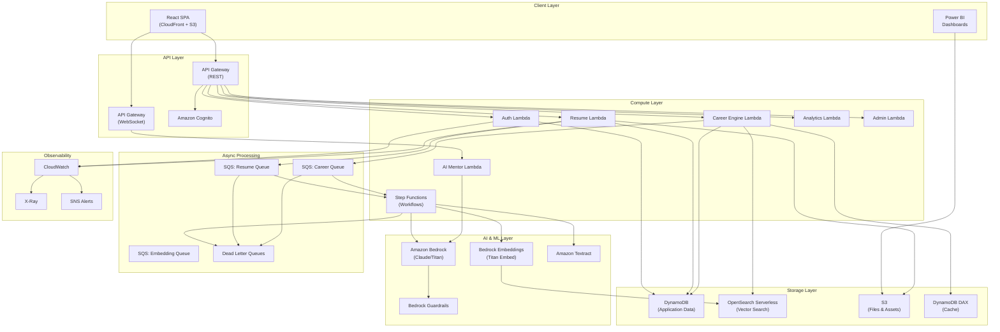
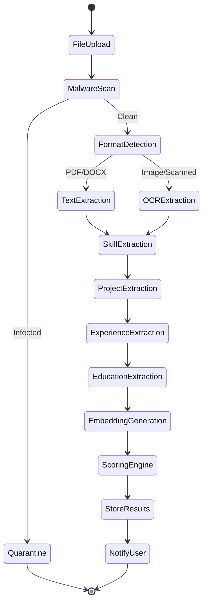
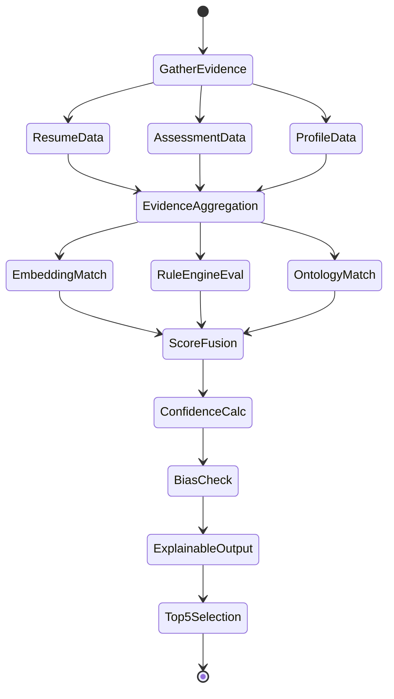
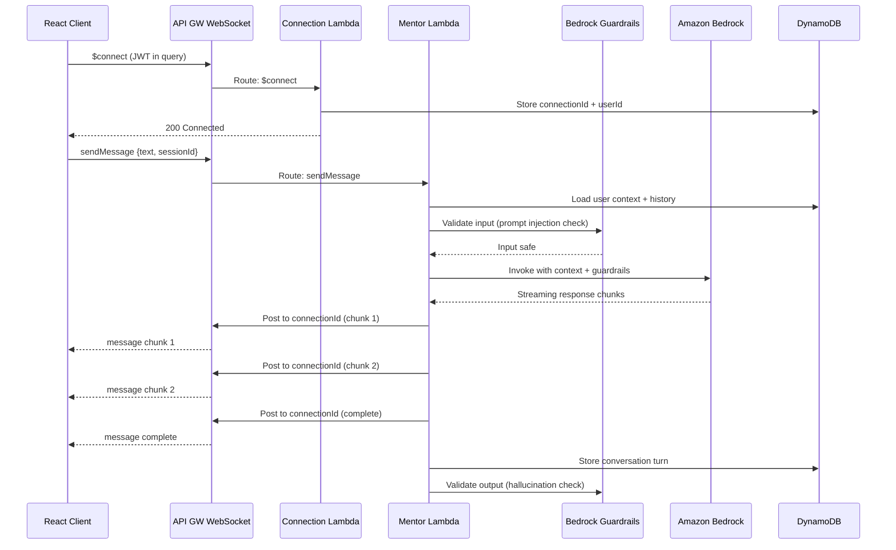
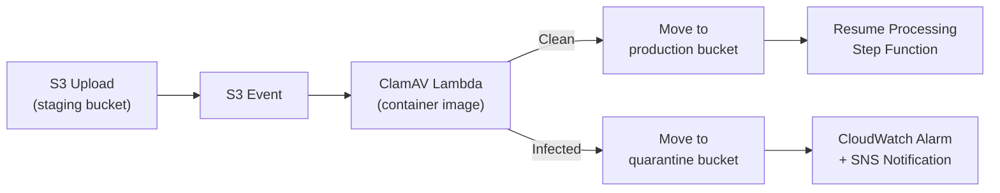
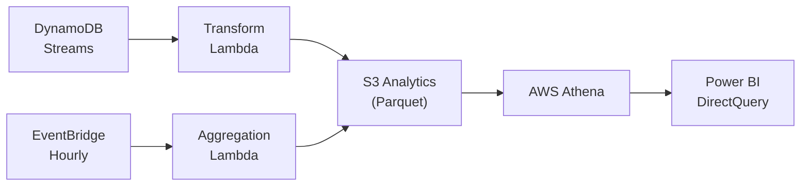
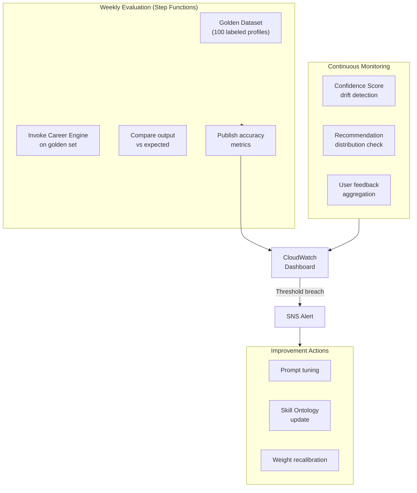

# Technical Design Document

## AI Career Intelligence Platform

---

## Overview

The AI Career Intelligence Platform is an enterprise-grade system that analyzes multiple evidence sources — resumes, AI assessments, GitHub profiles, LinkedIn data, portfolios, and certifications — to generate explainable, confidence-scored career recommendations across the entire technology ecosystem.

### Design Goals

1. **Evidence-Based Intelligence** — Every recommendation backed by traceable evidence from multiple sources
2. **Hybrid AI + ML Architecture** — Combining Amazon Bedrock inference, vector embeddings, rule engines, and skill ontology matching
3. **Real-Time Interactions** — WebSocket-powered AI Mentor chat with streaming responses
4. **Async Processing Pipeline** — SQS-backed queue system for resume parsing, embedding generation, and recommendation computation
5. **AI Safety First** — Guardrails for hallucination detection, prompt injection prevention, and bias monitoring
6. **Scalable Serverless** — Auto-scaling AWS infrastructure supporting 10,000+ concurrent users
7. **Observable & Auditable** — Full tracing, structured logging, and compliance-ready audit trails

### Key Design Decisions

| Decision | Choice | Rationale |
|----------|--------|-----------|
| Vector Search | Amazon OpenSearch Serverless (k-NN) | Native vector similarity search, managed scaling, integrates with existing AWS stack |
| Real-Time Chat | API Gateway WebSocket API | Native AWS integration, scales with Lambda, supports connection management |
| Async Processing | Amazon SQS + DLQ | Reliable message delivery, built-in retry, dead letter queues for failure handling |
| Workflow Orchestration | AWS Step Functions | Visual workflows, error handling, parallel processing for multi-step pipelines |
| AI Safety | Amazon Bedrock Guardrails + Custom Lambda | Content filtering, topic denial, PII detection, hallucination scoring |
| Frontend | React SPA + CloudFront + S3 | Fast global delivery, SPA routing, cost-effective static hosting |
| Data Pipeline (Power BI) | DynamoDB Streams → Lambda → S3 (Parquet) → Power BI DirectQuery | Near real-time analytics, cost-effective, supports incremental refresh |
| File Security | S3 trigger → Lambda (ClamAV) | Scans uploads before processing, quarantine pattern for malware |
| LinkedIn Integration | User-provided PDF export | Legal compliance — avoids ToS violations from automated scraping |
| MLOps | Step Functions + CloudWatch Metrics + Bedrock Model Evaluation | Continuous quality monitoring, automated drift detection, prompt regression testing |


---

## Architecture

### High-Level System Architecture




### Resume Processing Pipeline (Step Functions Workflow)



### Career Recommendation Pipeline




### AI Mentor Real-Time Architecture



---

## Components and Interfaces

### Module Decomposition

The platform is organized into 16 modules with clear API boundaries, enabling future microservice extraction.

| Module | Primary Lambda(s) | Data Store | External Services |
|--------|-------------------|------------|-------------------|
| Authentication | auth-service | DynamoDB + Cognito | Google OAuth |
| Resume Intelligence | resume-parser, resume-scorer | DynamoDB + S3 + OpenSearch | Textract |
| AI Career Assessment | assessment-engine | DynamoDB | Bedrock |
| Career Recommendations | career-engine | DynamoDB + OpenSearch + DAX | Bedrock |
| Skill Gap Analysis | skill-analyzer | DynamoDB + DAX | Bedrock |
| AI Mentor | mentor-service | DynamoDB | Bedrock (WebSocket) |
| External Profiles | profile-analyzer | DynamoDB | GitHub API |
| Analytics | analytics-aggregator | DynamoDB + S3 | Power BI |
| Administration | admin-service | DynamoDB | — |
| Notifications | notification-service | DynamoDB | SES, SNS |
| Reports | report-generator | DynamoDB + S3 | — |
| AWS Infrastructure | (CDK/CloudFormation) | — | All AWS services |
| AI Prompt Management | prompt-manager | DynamoDB | Bedrock |
| Security | (cross-cutting) | DynamoDB | WAF, KMS |
| Performance | (cross-cutting) | DAX, CloudFront | CloudWatch |
| Future Enhancements | (reserved) | — | — |


### Core Service Interfaces

#### 1. Auth Service API

```typescript
// POST /v1/auth/register
interface RegisterRequest {
  email: string;
  password: string;
  firstName: string;
  lastName: string;
}
interface RegisterResponse {
  userId: string;
  message: string;
  verificationEmailSent: boolean;
}

// POST /v1/auth/login
interface LoginRequest {
  email: string;
  password: string;
}
interface LoginResponse {
  accessToken: string;  // JWT, 1hr expiry
  refreshToken: string; // 7-day expiry
  user: UserProfile;
}

// POST /v1/auth/refresh
interface RefreshRequest {
  refreshToken: string;
}
interface RefreshResponse {
  accessToken: string;
}
```

#### 2. Resume Service API

```typescript
// POST /v1/resumes/upload
interface ResumeUploadRequest {
  file: File;          // PDF, DOCX, PNG, JPG, JPEG; max 10MB
  version?: string;    // Optional version label
}
interface ResumeUploadResponse {
  resumeId: string;
  version: number;
  status: 'processing' | 'queued';
  estimatedCompletionSeconds: number;
}

// GET /v1/resumes/{resumeId}/analysis
interface ResumeAnalysis {
  resumeId: string;
  status: 'complete' | 'processing' | 'failed';
  qualityScore: Score;          // 0-100 with sub-scores
  atsScore: Score;              // 0-100 with sub-scores
  skills: ExtractedSkill[];
  projects: ExtractedProject[];
  experience: ExtractedExperience[];
  education: ExtractedEducation[];
  certifications: ExtractedCertification[];
  confidenceScore: number;      // 0-100
  improvements: Suggestion[];
}
```

#### 3. Career Engine API

```typescript
// POST /v1/careers/generate-recommendations
interface GenerateRecommendationsRequest {
  userId: string;
  forceRegenerate?: boolean;
}
interface CareerRecommendation {
  careerId: string;
  title: string;
  fitScore: CareerFitScore;     // 0-100 with breakdown
  confidenceScore: number;       // 0-100
  evidence: EvidencePoint[];     // min 3 per recommendation
  salaryRange: SalaryRange;
  marketDemand: MarketDemandScore;
  readinessScore: number;        // 0-100
  category: 'Strong Match' | 'Emerging Match';
}
interface RecommendationResponse {
  top5: CareerRecommendation[];
  alternatives: CareerRecommendation[];
  generatedAt: string;
  evidenceSources: string[];
}

// POST /v1/careers/compare
interface CompareRequest {
  careerIds: string[];  // 2-3 careers
}
```


#### 4. AI Mentor WebSocket API

```typescript
// WebSocket Routes
// $connect — establishes connection with JWT auth
// $disconnect — cleans up connection state
// sendMessage — client sends a message
// receiveMessage — server pushes response chunks

interface MentorMessage {
  action: 'sendMessage';
  sessionId: string;
  text: string;
  context?: 'career' | 'resume' | 'interview' | 'learning' | 'cover-letter';
}

interface MentorResponse {
  type: 'chunk' | 'complete' | 'error';
  sessionId: string;
  text: string;
  metadata?: {
    tokensUsed: number;
    groundedInEvidence: boolean;
    confidenceScore: number;
  };
}
```

#### 5. Skill Analyzer API

```typescript
// GET /v1/skills/inventory/{userId}
interface SkillInventory {
  skills: UnifiedSkill[];
  totalSkills: number;
  lastUpdated: string;
}

// POST /v1/skills/gap-analysis
interface GapAnalysisRequest {
  userId: string;
  targetCareerId: string;
}
interface GapAnalysisResponse {
  currentSkills: UnifiedSkill[];
  requiredSkills: RequiredSkill[];
  gaps: SkillGap[];
  learningPriorities: PrioritizedSkill[];
  estimatedTimeToReady: TimeRange;
  roadmap: LearningRoadmap;
}
```

#### 6. Vector Search Interface (OpenSearch)

```typescript
interface VectorSearchRequest {
  embedding: number[];           // 1536-dim Titan embedding
  index: 'career-paths' | 'skills' | 'student-profiles';
  k: number;                     // number of nearest neighbors
  filters?: Record<string, any>; // metadata filters
  minScore?: number;             // minimum similarity threshold
}

interface VectorSearchResult {
  id: string;
  score: number;                 // cosine similarity 0-1
  metadata: Record<string, any>;
}
```

#### 7. AI Safety Interface

```typescript
interface SafetyCheckRequest {
  input: string;
  context: 'assessment' | 'mentor' | 'cover-letter' | 'recommendation';
  userId: string;
}

interface SafetyCheckResponse {
  safe: boolean;
  violations: SafetyViolation[];
  sanitizedInput?: string;
  action: 'allow' | 'block' | 'modify';
}

interface OutputValidation {
  response: string;
  groundingScore: number;        // 0-100, how grounded in evidence
  hallucinationRisk: 'low' | 'medium' | 'high';
  biasIndicators: BiasFlag[];
  action: 'pass' | 'flag' | 'block';
}
```


#### 8. Async Processing Interface (SQS)

```typescript
// Resume Processing Queue Message
interface ResumeQueueMessage {
  messageType: 'RESUME_PROCESS';
  userId: string;
  resumeId: string;
  s3Key: string;
  fileType: 'pdf' | 'docx' | 'png' | 'jpg' | 'jpeg';
  uploadedAt: string;
  retryCount: number;
}

// Career Recommendation Queue Message
interface CareerQueueMessage {
  messageType: 'CAREER_GENERATE';
  userId: string;
  triggers: ('resume_complete' | 'assessment_complete' | 'profile_updated')[];
  priority: 'high' | 'normal';
}

// Embedding Generation Queue Message
interface EmbeddingQueueMessage {
  messageType: 'EMBEDDING_GENERATE';
  entityType: 'student_profile' | 'career_path' | 'skill';
  entityId: string;
  text: string;
  metadata: Record<string, any>;
}

// Queue Configuration
interface QueueConfig {
  visibilityTimeout: 300;        // 5 minutes
  messageRetention: 1209600;     // 14 days
  maxReceiveCount: 3;            // before DLQ
  delaySeconds: 0;
  batchSize: 10;
}
```

#### 9. Power BI Data Pipeline Interface

```typescript
// DynamoDB Stream → Lambda → S3 (Parquet)
interface AnalyticsEvent {
  eventType: 'USER_REGISTERED' | 'RESUME_ANALYZED' | 'RECOMMENDATION_GENERATED' 
    | 'ASSESSMENT_COMPLETED' | 'SKILL_GAP_IDENTIFIED' | 'PLACEMENT_REPORTED';
  userId: string;
  timestamp: string;
  data: Record<string, any>;
  partitionKey: string;          // YYYY-MM-DD for S3 partitioning
}

// S3 Output Structure: s3://analytics-bucket/{event_type}/year={YYYY}/month={MM}/day={DD}/
// Format: Apache Parquet with Snappy compression
// Power BI connects via DirectQuery to S3 through Athena
```

#### 10. File Security Interface

```typescript
interface FileScanRequest {
  s3Bucket: string;
  s3Key: string;
  fileSize: number;
  uploadedBy: string;
}

interface FileScanResult {
  clean: boolean;
  scanEngine: 'ClamAV';
  scanDuration: number;
  threats?: string[];
  action: 'allow' | 'quarantine' | 'delete';
  quarantineBucket?: string;
}
```


### Frontend Architecture (React SPA)

```
src/
├── app/
│   ├── store.ts              # Redux Toolkit store configuration
│   ├── router.tsx            # React Router v6 configuration
│   └── App.tsx               # Root component with providers
├── features/
│   ├── auth/                 # Login, Register, OAuth, Password Reset
│   ├── resume/               # Upload, Analysis, Versions, Comparison
│   ├── assessment/           # Conversational AI Assessment
│   ├── career/               # Recommendations, Comparison, Roadmap
│   ├── skills/               # Inventory, Gaps, Learning Plan
│   ├── mentor/               # WebSocket Chat Interface
│   ├── profiles/             # GitHub, LinkedIn, Portfolio connections
│   ├── reports/              # Report Generation and Export
│   ├── notifications/        # In-app notification system
│   └── admin/                # Admin dashboard and management
├── shared/
│   ├── components/           # Reusable UI components (Material UI)
│   ├── hooks/                # Custom React hooks
│   ├── utils/                # Utility functions
│   ├── api/                  # API client (Axios + React Query)
│   └── types/                # Shared TypeScript types
├── styles/                   # Tailwind CSS + theme configuration
└── tests/                    # Test utilities and setup
```

**Frontend Stack:**
- React 18+ with TypeScript
- Redux Toolkit for global state (auth, user profile, career data)
- React Query (TanStack Query) for server state management
- Material UI v5 for component library
- Tailwind CSS for utility-first styling
- React Router v6 for SPA routing
- Framer Motion for animations
- Recharts for data visualization
- WebSocket native API for AI Mentor chat
- Vite for build tooling (bundle size target: < 500KB gzipped initial)

**State Management Strategy:**
- Redux Toolkit: Authentication state, user profile, active career selections
- React Query: All server data (resumes, recommendations, analytics) with caching
- Local component state: UI-only state (modals, form inputs, animations)
- WebSocket state: Custom hook managing connection lifecycle + message queue

---

## Data Models

### DynamoDB Single-Table Design

The platform uses a single-table design pattern with the following primary key structure:

```
Table: ai-career-platform
  Partition Key (PK): String
  Sort Key (SK): String
  GSI1PK / GSI1SK: Global Secondary Index 1
  GSI2PK / GSI2SK: Global Secondary Index 2
```


### Entity Access Patterns

| Entity | PK | SK | GSI1PK | GSI1SK | Access Pattern |
|--------|----|----|--------|--------|----------------|
| User Profile | USER#{userId} | PROFILE | EMAIL#{email} | USER#{userId} | Get by ID, Get by email |
| Resume | USER#{userId} | RESUME#{resumeId} | RESUME#{resumeId} | STATUS#{status} | List user resumes, Get by ID |
| Resume Version | USER#{userId} | RESUME#{resumeId}#V#{version} | — | — | Version history |
| Skills (extracted) | USER#{userId} | SKILL#{skillId} | SKILL#{skillName} | USER#{userId} | User skills, Skill frequency |
| Assessment | USER#{userId} | ASSESSMENT#{assessmentId} | — | — | User assessments |
| Assessment Session | USER#{userId} | ASESS_SESSION#{sessionId} | — | — | Assessment progress |
| Career Recommendation | USER#{userId} | CAREER_REC#{timestamp} | — | — | Latest recommendations |
| Career Path | CAREER#{careerId} | METADATA | CATEGORY#{domain} | CAREER#{careerId} | Browse by domain |
| Skill Ontology | ONTOLOGY | SKILL#{skillId} | DOMAIN#{domain} | SKILL#{skillId} | Browse skills by domain |
| AI Conversation | USER#{userId} | CONV#{sessionId}#MSG#{timestamp} | — | — | Chat history |
| WebSocket Connection | CONN#{connectionId} | METADATA | USER#{userId} | CONN#{connectionId} | Connection management |
| Notification | USER#{userId} | NOTIF#{timestamp} | NOTIF_STATUS | UNREAD#{userId} | Unread notifications |
| Report | USER#{userId} | REPORT#{reportId} | — | — | User reports |
| Prompt Template | PROMPT#{templateId} | V#{version} | PROMPT_CAT#{category} | PROMPT#{templateId} | Prompts by category |
| Audit Log | AUDIT#{date} | #{timestamp}#{eventId} | AUDIT_USER#{userId} | #{timestamp} | Audit by date, by user |
| Feedback | USER#{userId} | FEEDBACK#{recommendationId} | — | — | User feedback on recs |
| Learning Roadmap | USER#{userId} | ROADMAP#{careerId} | — | — | User roadmaps |
| Session/Token | TOKEN#{tokenId} | METADATA | USER#{userId} | TOKEN#{tokenId} | Token blacklist |

### OpenSearch Serverless Vector Indices

```json
{
  "career-paths-index": {
    "settings": {
      "index.knn": true,
      "index.knn.algo_param.ef_search": 512
    },
    "mappings": {
      "properties": {
        "career_id": { "type": "keyword" },
        "title": { "type": "text" },
        "domain": { "type": "keyword" },
        "embedding": {
          "type": "knn_vector",
          "dimension": 1536,
          "method": {
            "name": "hnsw",
            "space_type": "cosinesimil",
            "engine": "nmslib"
          }
        },
        "required_skills": { "type": "keyword" },
        "market_demand": { "type": "float" },
        "updated_at": { "type": "date" }
      }
    }
  },
  "student-profiles-index": {
    "mappings": {
      "properties": {
        "user_id": { "type": "keyword" },
        "embedding": {
          "type": "knn_vector",
          "dimension": 1536,
          "method": {
            "name": "hnsw",
            "space_type": "cosinesimil",
            "engine": "nmslib"
          }
        },
        "skills": { "type": "keyword" },
        "experience_years": { "type": "integer" },
        "updated_at": { "type": "date" }
      }
    }
  }
}
```


### Key Domain Models

```typescript
interface UserProfile {
  userId: string;
  email: string;
  firstName: string;
  lastName: string;
  role: 'Student' | 'Admin' | 'Super_Admin';
  profileCompleteness: number;       // 0-100
  createdAt: string;
  lastLoginAt: string;
  mfaEnabled: boolean;
  notificationPreferences: NotificationPreferences;
  version: number;                    // optimistic locking
}

interface ExtractedSkill {
  skillId: string;
  name: string;
  category: string;                   // From Skill_Ontology
  proficiency: 'Beginner' | 'Intermediate' | 'Advanced' | 'Expert';
  confidenceScore: number;            // 0-100
  evidenceType: 'Direct' | 'Inferred' | 'Implicit';
  source: 'resume' | 'assessment' | 'github' | 'linkedin' | 'self_declared';
  sourceReference: string;            // Link to original text
  recency: 'current' | 'recent' | 'dated';
}

interface CareerFitScore {
  total: number;                      // 0-100
  technicalFit: number;               // 0-30
  interestFit: number;                // 0-25
  personalityFit: number;             // 0-25
  marketFit: number;                  // 0-20
}

interface EvidencePoint {
  evidenceId: string;
  type: 'Strong' | 'Moderate' | 'Suggestive';
  source: 'resume' | 'assessment' | 'github' | 'linkedin' | 'portfolio';
  description: string;                // Natural language explanation
  rawReference: string;               // Link to source data
  weight: number;                     // Contribution to score
}

interface SkillGap {
  skillId: string;
  skillName: string;
  category: 'Critical' | 'Proficiency' | 'Optional';
  currentLevel: string | null;
  requiredLevel: string;
  severity: number;                   // 0-100
  difficulty: 'Easy' | 'Moderate' | 'Challenging' | 'Expert-level';
  estimatedTime: string;              // e.g., "2-4 weeks"
  prerequisites: string[];
}

interface LearningRoadmap {
  roadmapId: string;
  userId: string;
  targetCareerId: string;
  timeCommitmentHoursPerWeek: number;
  weeks: RoadmapWeek[];
  milestones: Milestone[];
  estimatedCompletionDate: string;
  progress: number;                   // 0-100
}

interface AIConversation {
  sessionId: string;
  userId: string;
  context: 'career' | 'resume' | 'interview' | 'learning' | 'cover-letter';
  messages: ConversationMessage[];
  createdAt: string;
  lastMessageAt: string;
  tokenCount: number;
}

interface ConversationMessage {
  role: 'user' | 'assistant' | 'system';
  content: string;
  timestamp: string;
  safetyCheck: {
    inputSafe: boolean;
    outputGrounded: boolean;
    hallucinationRisk: 'low' | 'medium' | 'high';
  };
}

interface RecommendationFeedback {
  feedbackId: string;
  userId: string;
  recommendationId: string;
  careerId: string;
  rating: 1 | 2 | 3 | 4 | 5;
  relevance: 'highly_relevant' | 'somewhat_relevant' | 'not_relevant';
  comments?: string;
  outcome?: 'pursued' | 'got_job' | 'not_interested';
  createdAt: string;
}
```

### Analytics Data Pipeline Schema (S3 Parquet)

```typescript
// Partitioned by: event_type/year/month/day
interface AnalyticsRecord {
  eventId: string;
  eventType: string;
  userId: string;                     // Anonymized for Power BI
  timestamp: string;
  // Event-specific fields flattened
  careerPath?: string;
  fitScore?: number;
  confidenceScore?: number;
  skillCount?: number;
  atsScore?: number;
  resumeQualityScore?: number;
  assessmentCompleteness?: number;
  placementAligned?: boolean;
}
```


### Addressing Critical Architectural Gaps

#### Gap 1: Vector Search Strategy (OpenSearch Serverless)

**Problem**: DynamoDB cannot perform vector similarity search needed for embedding-based career matching (Req 48).

**Solution**: Amazon OpenSearch Serverless with k-NN plugin.

- **Index Design**: Two primary indices — `career-paths-index` (500+ career embeddings) and `student-profiles-index` (user profile embeddings)
- **Embedding Model**: Amazon Titan Embeddings V2 (1536 dimensions) via Bedrock
- **Search Method**: HNSW (Hierarchical Navigable Small World) with cosine similarity
- **Update Strategy**: Career path embeddings regenerated monthly via scheduled Step Function; student profile embeddings regenerated on each profile data change via SQS queue
- **Fallback**: If OpenSearch is unavailable, degrade to Skill Ontology keyword matching only (reduced quality, higher availability)

#### Gap 2: AI Safety Guardrails

**Problem**: No protection against hallucination, prompt injection, or bias in AI outputs.

**Solution**: Multi-layer safety architecture:

1. **Input Layer** — Amazon Bedrock Guardrails (content filters, denied topics, PII detection)
2. **Prompt Layer** — System prompt hardening with role boundaries; input sanitization Lambda strips injection patterns
3. **Output Layer** — Custom grounding check Lambda: compares AI response against known facts in DynamoDB; assigns `groundingScore` (0-100)
4. **Bias Layer** — Scheduled bias audit Lambda: monitors recommendation distribution across demographic groups; alerts if any single career > 25% (Req 85.3)
5. **Monitoring** — CloudWatch custom metric `ai.safety.violations` with alarm threshold

```typescript
// Safety pipeline (executed on every AI interaction)
const safePipeline = [
  sanitizeInput,              // Remove injection patterns
  checkBedrockGuardrails,     // Content filter + topic denial
  invokeBedrockWithGuardrails,// Model call with system constraints
  validateOutput,             // Grounding + hallucination check
  logSafetyMetrics,           // CloudWatch metrics
];
```

#### Gap 3: WebSocket Real-Time Architecture

**Problem**: AI Mentor chat requires real-time streaming, not REST request/response.

**Solution**: API Gateway WebSocket API with Lambda integration.

- **Connection Management**: `$connect` route validates JWT, stores `{connectionId, userId}` in DynamoDB with 2-hour TTL
- **Message Routing**: `sendMessage` route invokes Mentor Lambda with user context
- **Streaming**: Bedrock `InvokeModelWithResponseStream` → Lambda posts chunks back via `@connections/{connectionId}`
- **Heartbeat**: Client sends ping every 30s; server-side TTL cleans stale connections
- **Reconnection**: Client auto-reconnects with exponential backoff; resumes from last message via session ID

#### Gap 4: Queue Service (SQS)

**Problem**: Async operations lack reliable queuing for retry and backpressure.

**Solution**: Three dedicated SQS queues with DLQ configuration:

| Queue | Purpose | Visibility Timeout | Max Receives | DLQ Retention |
|-------|---------|-------------------|--------------|---------------|
| resume-processing | Resume parse + score pipeline | 5 min | 3 | 14 days |
| career-generation | Recommendation generation | 10 min | 3 | 14 days |
| embedding-generation | Profile/career embedding updates | 5 min | 3 | 14 days |

- **Backpressure**: Lambda concurrency limits per queue (resume: 20, career: 10, embedding: 30)
- **Priority**: Career generation supports priority field for user-initiated vs background regeneration
- **Monitoring**: CloudWatch alarms on `ApproximateAgeOfOldestMessage` > 5 min and DLQ message count > 0


#### Gap 5: Frontend Architecture

**Problem**: React/Tailwind/Material UI mentioned but no architectural requirements defined.

**Solution**: Feature-based React SPA architecture (detailed in Components section above).

- **Hosting**: S3 static website + CloudFront CDN with custom domain and SSL
- **Build**: Vite with code splitting per route; initial bundle < 500KB gzipped
- **State**: Redux Toolkit (global) + React Query (server) + local state (UI)
- **Auth**: Cognito Amplify library for token management and OAuth flows
- **Real-time**: Native WebSocket with reconnection hook for AI Mentor
- **Accessibility**: WCAG 2.1 AA compliance, keyboard navigation, ARIA labels
- **Performance Budget**: FCP < 1.5s, TTI < 3s, LCP < 2.5s

#### Gap 6: File Upload Security Scanning

**Problem**: Uploaded resumes could contain malware.

**Solution**: S3 event trigger → ClamAV Lambda scanner.



- **Two-bucket pattern**: Files upload to `staging` bucket; only clean files move to `production` bucket
- **ClamAV**: Runs in Lambda container (Amazon Linux + ClamAV); virus definitions updated daily via scheduled Lambda
- **Timeout**: 60-second scan timeout for 10MB max file size
- **User notification**: If file quarantined, push notification + email explaining upload was rejected

#### Gap 7: Power BI Data Pipeline

**Problem**: No defined path from DynamoDB operational data to Power BI analytics.

**Solution**: DynamoDB Streams → Lambda → S3 (Parquet) → Athena → Power BI.



- **Stream Processing**: DynamoDB Streams trigger Lambda on INSERT/MODIFY of analytics-relevant records
- **Transform**: Lambda converts DynamoDB JSON to flat analytics records, writes Parquet to date-partitioned S3 paths
- **Aggregation**: Hourly EventBridge rule triggers aggregation Lambda for summary metrics (totals, averages, distributions)
- **Power BI Connection**: DirectQuery via Athena ODBC connector; incremental refresh on daily partitions
- **Embedding Strategy**: Power BI Embedded for admin dashboards within React app; separate Power BI workspace for detailed reports

#### Gap 8: LinkedIn Data Access Compliance

**Problem**: LinkedIn restricts automated scraping; legal compliance unclear.

**Solution**: User-provided data only — no automated LinkedIn access.

- **Primary Method**: Students upload LinkedIn PDF export (Profile → Settings → Get a copy of your data)
- **Processing**: PDF parsed via Textract (same as resume pipeline) to extract skills, experience, education, connections count
- **Consent**: Explicit consent screen explaining what data is extracted and how it's used
- **No API Access**: Platform does NOT use LinkedIn API or scraping tools
- **Alternative**: Students can manually enter LinkedIn data via structured form
- **Future**: If LinkedIn Marketing Developer Platform access is obtained, add OAuth-based integration

#### Gap 9: MLOps / Model Evaluation Pipeline

**Problem**: No continuous evaluation or improvement of AI recommendation quality.

**Solution**: Scheduled evaluation pipeline with feedback loop.



- **Golden Dataset**: 100 manually-labeled student profiles with known-correct career mappings; maintained by Admin team
- **Weekly Eval**: Step Function runs career engine on golden set, computes accuracy (% matching expected top-3), precision, recall
- **Drift Detection**: If weekly average Confidence_Score drops > 5% from 30-day baseline, trigger alert
- **Prompt Regression**: On any prompt template change, automatically re-run golden dataset evaluation before production deploy
- **Feedback Integration**: Monthly aggregation of student feedback (Req 60 feedback loop) to identify underperforming recommendations

#### Gap 10: Recommendation Feedback Loop

**Problem**: Without student feedback, recommendation quality cannot improve.

**Solution**: Multi-signal feedback collection and integration.

- **Explicit Feedback**: After viewing recommendations, students can rate (1-5 stars) and mark relevance
- **Implicit Feedback**: Track which recommendations students click, explore further, create roadmaps for
- **Outcome Tracking**: When students report job placement, record whether it matched a recommendation
- **Integration**: Monthly Lambda job aggregates feedback, identifies careers with consistently low ratings, surfaces to Admin for review
- **Model Impact**: Feedback scores weight future recommendations — careers with high user satisfaction get slight boost; consistently poor ratings flag for Skill Ontology review


---

## Correctness Properties

*A property is a characteristic or behavior that should hold true across all valid executions of a system — essentially, a formal statement about what the system should do. Properties serve as the bridge between human-readable specifications and machine-verifiable correctness guarantees.*

### Property 1: Resume Quality Score decomposition invariant

*For any* resume data input, the Resume_Quality_Score SHALL be in [0, 100], and its sub-scores (Content in [0,25], Formatting in [0,25], Keywords in [0,25], Completeness in [0,25]) SHALL each be in their valid ranges and sum exactly to the total Resume_Quality_Score.

**Validates: Requirements 30.1, 30.2**

### Property 2: ATS Score bounded output

*For any* valid resume data input, the calculated ATS_Score SHALL be in the range [0, 100].

**Validates: Requirements 31.1**

### Property 3: Career evidence weight formula

*For any* set of evidence source scores (each in [0, 100]) from resume analysis, AI assessment, external profiles, and skill ontology match, the combined Career_Fit_Score SHALL equal 0.30 × resume + 0.30 × assessment + 0.20 × profiles + 0.20 × ontology (within floating point tolerance).

**Validates: Requirements 47.2**

### Property 4: Cosine similarity bounds

*For any* two valid embedding vectors of dimension 1536, the computed cosine similarity SHALL be in [-1, 1]. For any embedding compared to itself, the similarity SHALL be 1.0.

**Validates: Requirements 48.2**

### Property 5: Skill ontology categorization completeness

*For any* skill name present in the Skill_Ontology, the categorization function SHALL return exactly one of: Technical Skills, Soft Skills, Tools, Frameworks, Languages, or Platforms.

**Validates: Requirements 19.1**

### Property 6: Transferable skill mapping

*For any* skill marked as "transferable" in the Skill_Ontology, it SHALL map to at least 2 distinct career paths.

**Validates: Requirements 50.2**

### Property 7: Confidence threshold filter

*For any* set of career recommendations returned to a student, every recommendation in the set SHALL have a Confidence_Score >= 40.

**Validates: Requirements 51.2**

### Property 8: Minimum evidence per recommendation

*For any* career recommendation presented to a student, it SHALL be accompanied by at least 3 evidence points.

**Validates: Requirements 52.1**


### Property 9: Career Fit Score decomposition invariant

*For any* career fit calculation, the total Career_Fit_Score SHALL be in [0, 100] and SHALL equal Technical Fit (in [0,30]) + Interest Fit (in [0,25]) + Personality Fit (in [0,25]) + Market Fit (in [0,20]).

**Validates: Requirements 53.1, 53.2**

### Property 10: Recommendation diversity constraint

*For any* top-5 career recommendation set generated for a student, the number of unique technology domains represented SHALL be >= 3.

**Validates: Requirements 56.2**

### Property 11: Career Readiness Score decomposition invariant

*For any* career readiness calculation, the total Career_Readiness_Score SHALL be in [0, 100] and SHALL equal Skills Readiness (in [0,30]) + Experience Readiness (in [0,25]) + Education Readiness (in [0,20]) + Certification Readiness (in [0,15]) + Portfolio Readiness (in [0,10]).

**Validates: Requirements 60.1**

### Property 12: Skill conflict resolution correctness

*For any* set of skill assessments from multiple sources (resume, assessment, github, linkedin, self_declared), each with a confidence-weighted proficiency level, the reconciled skill level SHALL equal the proficiency from the source with the highest weighted confidence score.

**Validates: Requirements 62.2**

### Property 13: Skill gap categorization correctness

*For any* comparison between a student's current skill set and a career's required skill set: if a must-have skill is absent, it SHALL be categorized as "Critical Gap"; if a skill is present but below required proficiency level, it SHALL be categorized as "Proficiency Gap"; if a nice-to-have skill is absent, it SHALL be categorized as "Optional Gap".

**Validates: Requirements 64.2**

### Property 14: Learning priority monotonicity

*For any* set of skill gaps ranked by learning priority, the priority ordering SHALL be monotonically non-increasing — each skill's priority score SHALL be >= the priority score of the next skill in the list.

**Validates: Requirements 65.1**

### Property 15: Bias detection threshold

*For any* recommendation distribution across career paths, the bias flag SHALL be set to true if and only if max(career_count) / total_recommendations > 0.25.

**Validates: Requirements 85.3**

### Property 16: Prompt template interpolation completeness

*For any* prompt template containing `{{variable_name}}` placeholders and a complete variable map (all referenced variables present), the rendered output SHALL contain zero unresolved `{{...}}` patterns and SHALL contain all substituted values.

**Validates: Requirements 122.3**

### Property 17: JWT claims round-trip

*For any* valid claims object (containing userId, role, sessionId, issuedAt, expiration), encoding to a JWT and then decoding SHALL produce a claims object equivalent to the original.

**Validates: Requirements 129.2**

### Property 18: Input length validation correctness

*For any* text input of length > 10,000 characters, the validation function SHALL reject it. *For any* text input of length <= 10,000 characters (and otherwise valid), the validation function SHALL accept it. The same property holds for URL fields with threshold 2,048.

**Validates: Requirements 130.3**

### Property 19: Rate limiter correctness

*For any* sequence of N requests from a single user within a 1-minute window, the rate limiter SHALL allow exactly min(N, 100) requests and reject the remainder with HTTP 429.

**Validates: Requirements 131.1**


---

## Error Handling

### Error Response Standard (RFC 7807 Problem Details)

All API endpoints return errors in a consistent format:

```json
{
  "type": "https://api.careerplatform.com/errors/validation-failed",
  "title": "Validation Failed",
  "status": 400,
  "detail": "The password does not meet complexity requirements.",
  "instance": "/v1/auth/register",
  "traceId": "abc123-xyz789",
  "errors": [
    { "field": "password", "message": "Must contain at least one uppercase letter" }
  ]
}
```

### Error Categories and Handling Strategies

| Category | HTTP Status | Retry | User Action | Logging |
|----------|-------------|-------|-------------|---------|
| Validation Error | 400 | No | Fix input | INFO |
| Authentication Failed | 401 | No | Re-login | WARN |
| Authorization Denied | 403 | No | Contact admin | WARN |
| Resource Not Found | 404 | No | Navigate away | INFO |
| Rate Limited | 429 | Yes (after Retry-After) | Wait | WARN |
| AI Service Timeout | 503 | Yes (3x exponential) | Show loading | ERROR |
| AI Safety Block | 422 | No | Rephrase input | WARN |
| File Scan Failed | 422 | No | Re-upload | ERROR |
| Queue Processing Failed | — | Yes (SQS retry + DLQ) | Notify later | ERROR |
| DynamoDB Throttle | 503 | Yes (exponential) | Auto-retry | WARN |
| Bedrock Capacity | 503 | Yes (exponential) | Show queue position | ERROR |

### Circuit Breaker Configuration

```typescript
interface CircuitBreakerConfig {
  service: string;
  failureThreshold: number;     // failures before opening
  recoveryTimeout: number;      // ms before half-open
  successThreshold: number;     // successes to close
}

const circuitBreakers: CircuitBreakerConfig[] = [
  { service: 'bedrock-inference', failureThreshold: 5, recoveryTimeout: 30000, successThreshold: 3 },
  { service: 'textract', failureThreshold: 3, recoveryTimeout: 60000, successThreshold: 2 },
  { service: 'opensearch', failureThreshold: 5, recoveryTimeout: 30000, successThreshold: 3 },
  { service: 'github-api', failureThreshold: 3, recoveryTimeout: 120000, successThreshold: 2 },
];
```

### Graceful Degradation Strategy

| Service Down | Degraded Behavior | User Impact |
|-------------|-------------------|-------------|
| Bedrock | Queue requests, show "processing" state | Delayed AI features |
| OpenSearch | Fall back to DynamoDB keyword matching | Reduced recommendation quality |
| Textract | Queue file, notify when complete | Delayed resume processing |
| SES | Queue notifications, retry later | Delayed email delivery |
| DAX | Direct DynamoDB reads (higher latency) | Slightly slower responses |
| Power BI | Show cached dashboard data | Stale analytics (max 1 hour) |

### Dead Letter Queue Processing

```typescript
// DLQ Processor (scheduled Lambda, runs every 15 minutes)
interface DLQMessage {
  originalMessage: SQSMessage;
  failureReason: string;
  failureCount: number;
  firstFailedAt: string;
  lastFailedAt: string;
}

// DLQ handling strategy:
// 1. Attempt count <= 5: Auto-retry with exponential backoff
// 2. Attempt count 6-10: Retry with simplified processing (skip optional steps)
// 3. Attempt count > 10: Alert admin, mark as failed, notify user
```

### AI-Specific Error Handling

| Scenario | Detection | Action |
|----------|-----------|--------|
| Hallucination detected | Grounding score < 40 | Block response, regenerate with stricter prompt |
| Prompt injection attempt | Safety check fails | Block input, log security event, increment user violation count |
| Bias detected in output | Distribution check fails | Log, flag for review, do not block (soft enforcement) |
| Token limit exceeded | Bedrock error response | Truncate context, retry with shortened prompt |
| Model response empty | Null/empty response | Retry once; if still empty, return graceful fallback message |
| Assessment conversation loops | Same topic > 3 turns | Advance to next dimension, log for prompt improvement |


---

## Testing Strategy

### Overview

The testing strategy employs a dual approach combining unit tests (specific examples, edge cases, error conditions) with property-based tests (universal properties across all inputs). This ensures both correctness at the individual level and robustness across the full input space.

### Property-Based Testing Configuration

**Library**: fast-check (TypeScript/JavaScript)

**Configuration**:
- Minimum 100 iterations per property test
- Seed-based reproducibility for CI determinism
- Verbose mode in CI for failure diagnosis
- Each property test tagged with design document reference

**Tag Format**: `Feature: ai-career-intelligence-platform, Property {number}: {property_text}`

**Property Test Targets** (mapped to Correctness Properties above):

| Property | Module Under Test | Generator Complexity |
|----------|-------------------|---------------------|
| 1: Resume Quality Score decomposition | Resume Intelligence | Medium — generate resume data objects |
| 2: ATS Score bounds | Resume Intelligence | Medium — generate resume data objects |
| 3: Career evidence weight formula | Career Engine | Low — generate 4 numbers in [0,100] |
| 4: Cosine similarity bounds | Career Engine (vector) | Low — generate pairs of float arrays |
| 5: Skill ontology categorization | Resume Intelligence | Low — generate skill names from ontology |
| 6: Transferable skill mapping | Career Engine | Low — filter ontology for transferable flag |
| 7: Confidence threshold filter | Career Engine | Medium — generate recommendation sets |
| 8: Minimum evidence per recommendation | Career Engine | Medium — generate recommendation objects |
| 9: Career Fit Score decomposition | Career Engine | Low — generate sub-score components |
| 10: Recommendation diversity | Career Engine | Medium — generate top-5 sets with domains |
| 11: Career Readiness Score decomposition | Career Engine | Low — generate sub-score components |
| 12: Skill conflict resolution | Skill Analyzer | Medium — generate multi-source skill sets |
| 13: Skill gap categorization | Skill Analyzer | Medium — generate current vs required sets |
| 14: Learning priority monotonicity | Skill Analyzer | Medium — generate prioritized skill lists |
| 15: Bias detection threshold | Analytics | Low — generate career count distributions |
| 16: Prompt template interpolation | Prompt Manager | Medium — generate templates + variable maps |
| 17: JWT claims round-trip | Auth Service | Low — generate claims objects |
| 18: Input length validation | Security (cross-cutting) | Low — generate strings of varying length |
| 19: Rate limiter correctness | Security (cross-cutting) | Low — generate request sequences |

### Unit Testing Strategy

**Framework**: Jest (with ts-jest for TypeScript)

**Coverage Targets**:
- Unit test coverage: >= 80% line coverage
- Integration test coverage: >= 60%
- Critical paths (auth, AI safety, data processing): 100%

**Unit Test Focus Areas**:
- Auth flows: registration, login, token refresh, password reset (specific scenarios)
- Resume parsing: known resume formats, edge cases (empty sections, malformed content)
- AI safety: known prompt injection patterns, specific harmful content examples
- Score calculations: boundary values (0, 50, 100), sub-score edge cases
- WebSocket: connection lifecycle, reconnection, message ordering
- Error handling: each error category with specific trigger conditions

### Integration Testing Strategy

**Environment**: Staging AWS environment with LocalStack for development

**Integration Test Targets**:
- Bedrock AI invocation and response handling (2-3 representative prompts)
- Textract document processing (sample PDF, DOCX, scanned image)
- DynamoDB CRUD operations for each entity type
- SQS message flow: enqueue → process → complete/DLQ
- Step Functions workflow execution (resume pipeline, career pipeline)
- WebSocket connection establishment and message exchange
- OpenSearch vector indexing and k-NN search
- S3 file upload → ClamAV scan → processing trigger
- Power BI data pipeline: DynamoDB change → S3 Parquet output
- End-to-end: Resume upload → Parse → Score → Recommend flow

### AI/ML Testing Strategy

- **Golden Dataset Evaluation**: 100 labeled profiles; weekly accuracy regression
- **Prompt Regression Suite**: For each prompt template change, run automated comparison against expected outputs
- **Bias Audit**: Monthly distribution check across demographic dimensions
- **Hallucination Detection Accuracy**: Measure false positive/negative rate of grounding checker against labeled examples
- **A/B Testing**: Prompt Manager supports parallel prompt versions with metric comparison

### Frontend Testing Strategy

- **Unit Tests**: React Testing Library for component logic; Mock Service Worker (MSW) for API mocking
- **Visual Regression**: Chromatic or Percy for catching unintended UI changes
- **Accessibility**: axe-core automated checks in CI; manual screen reader testing quarterly
- **E2E**: Playwright for critical user flows (register → upload resume → view recommendations)
- **Performance**: Lighthouse CI with budget thresholds (LCP < 2.5s, FID < 100ms, CLS < 0.1)

### Security Testing Strategy

- **SAST**: SonarQube in CI pipeline; block on critical/high findings
- **Dependency Scanning**: Snyk or Dependabot daily; block on critical CVEs
- **Prompt Injection Testing**: Dedicated test suite of known injection patterns against safety guardrails
- **Penetration Testing**: Quarterly by third party; critical findings remediated within 7 days
- **Container Scanning**: Trivy in CI for Lambda container images

### Load Testing Strategy

- **Tool**: k6 or Artillery
- **Scenarios**:
  - 10,000 concurrent authenticated users browsing
  - 500 simultaneous resume uploads
  - 100 concurrent AI Mentor WebSocket sessions
  - 200 concurrent recommendation generations
  - Burst: 3x normal load for 5 minutes
- **Success Criteria**: All API SLAs maintained (200ms reads, 500ms writes, 5s AI ops at p95)

