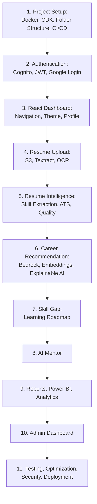

# Implementation Plan

## Overview

This implementation plan covers the AI Career Intelligence Platform — an enterprise-grade system analyzing multiple evidence sources (resumes, AI assessments, GitHub profiles, LinkedIn data, portfolios, certifications) to generate explainable, confidence-scored career recommendations. The platform is built on AWS serverless architecture using Amazon Bedrock, DynamoDB, Lambda, API Gateway (REST + WebSocket), SQS, Step Functions, OpenSearch Serverless, S3, Cognito, and CloudFront.

The plan is organized into 11 sprints, each building upon the previous, progressing from infrastructure through intelligence features to final hardening and deployment.

## Tasks

- [ ] 1. Sprint 1 — Project Setup: Docker, AWS CDK, Folder Structure, CI/CD
  - [ ] 1.1 Initialize monorepo project structure with TypeScript, Vite, and package configuration
  - [ ] 1.2 Set up Docker development environment (Dockerfile, docker-compose for local services)
  - [ ] 1.3 Set up AWS CDK infrastructure-as-code foundation with environment configs (dev, staging, prod)
  - [ ] 1.4 Configure DynamoDB single-table design with GSIs
  - [ ] 1.5 Configure S3 buckets (staging, production, quarantine, analytics, assets)
  - [ ] 1.6 Set up SQS queues with Dead Letter Queues
  - [ ] 1.7 Set up OpenSearch Serverless collection with vector indices
  - [ ] 1.8 Set up CloudWatch dashboards, alarms, and X-Ray tracing
  - [ ] 1.9 Set up CI/CD pipeline foundation (GitHub Actions or CodePipeline with lint, test, deploy stages)
  - [ ] 1.10 Configure project folder structure (shared types, utilities, service boundaries)
  - [ ] 1.11 Write unit tests for CDK stacks and infrastructure validation
- [ ] 2. Sprint 2 — Authentication: Cognito, JWT, Google Login
  - [ ] 2.1 Set up Amazon Cognito user pool and identity pool with password policies
  - [ ] 2.2 Set up API Gateway (REST) with Cognito authorizer base configuration
  - [ ] 2.3 Implement student registration endpoint (POST /v1/auth/register)
  - [ ] 2.4 Implement student login endpoint (POST /v1/auth/login)
  - [ ] 2.5 Implement Google OAuth login flow (redirect, callback, account linking)
  - [ ] 2.6 Implement JWT token management (refresh, validation, blacklisting)
  - [ ] 2.7 Implement email verification flow
  - [ ] 2.8 Implement forgot password flow
  - [ ] 2.9 Implement role-based access control (RBAC) middleware (Student, Admin, Super_Admin)
  - [ ] 2.10 Implement session management (inactivity timeout, concurrent session limits)
  - [ ] 2.11 Implement admin login with MFA
  - [ ] 2.12 Implement account settings (password change, email update, MFA toggle, account deletion)
  - [ ] 2.13 Implement notification preferences and activity history
  - [ ] 2.14 Implement security controls (CAPTCHA after failed attempts, HTTPS enforcement, password hashing)
  - [ ] 2.15 Write unit tests for auth service
  - [ ] 2.16 Write property-based test: JWT claims round-trip (Property 17)
- [ ] 3. Sprint 3 — React Dashboard: Navigation, Theme, Profile
  - [ ] 3.1 Set up React SPA foundation with Vite, React Router v6, and Redux Toolkit
  - [ ] 3.2 Configure Material UI v5 theme and Tailwind CSS utility styling
  - [ ] 3.3 Implement app shell layout (sidebar navigation, top bar, responsive breakpoints)
  - [ ] 3.4 Implement authentication UI (login, register, Google OAuth, password reset, email verification)
  - [ ] 3.5 Implement protected route guards and token refresh interceptor
  - [ ] 3.6 Implement user profile page (view/edit profile, profile photo upload, completeness indicator)
  - [ ] 3.7 Implement account settings UI (password change, MFA, notification preferences)
  - [ ] 3.8 Implement activity history and notification center UI
  - [ ] 3.9 Implement accessibility foundations (ARIA labels, keyboard navigation, screen reader support)
  - [ ] 3.10 Implement responsive design for mobile and tablet viewports
  - [ ] 3.11 Write frontend unit tests for auth flows and navigation
- [ ] 4. Sprint 4 — Resume Upload: S3, Textract, OCR
  - [ ] 4.1 Implement resume upload endpoint (POST /v1/resumes/upload) with file validation (PDF, DOCX, PNG, JPG, JPEG; max 10MB)
  - [ ] 4.2 Implement S3 presigned URL generation and direct upload flow
  - [ ] 4.3 Implement ClamAV malware scanning Lambda (S3 trigger, quarantine pattern)
  - [ ] 4.4 Implement text extraction for PDF/DOCX documents
  - [ ] 4.5 Implement OCR processing via Amazon Textract (scanned PDFs, images)
  - [ ] 4.6 Implement resume version management (up to 10 versions, active version selection)
  - [ ] 4.7 Implement resume upload and version history UI (drag-and-drop, progress indicator, version list)
  - [ ] 4.8 Write unit tests for file upload, scanning, and text extraction pipelines
- [ ] 5. Sprint 5 — Resume Intelligence: Skill Extraction, ATS, Resume Quality
  - [ ] 5.1 Implement skill extraction and categorization using Skill Ontology (Technical, Soft, Tools, Frameworks, Languages, Platforms)
  - [ ] 5.2 Implement proficiency level assignment and confidence scoring for extracted skills
  - [ ] 5.3 Implement project extraction (name, description, technologies, complexity scoring)
  - [ ] 5.4 Implement education extraction (degree, institution, GPA, coursework, achievements)
  - [ ] 5.5 Implement experience extraction (company, title, duration, responsibilities, career progression)
  - [ ] 5.6 Implement certification and technology detection with ontology mapping
  - [ ] 5.7 Implement leadership detection and communication analysis scoring
  - [ ] 5.8 Implement evidence extraction and tagging (Direct, Inferred, Implicit)
  - [ ] 5.9 Implement Resume Quality Score calculation (Content, Formatting, Keywords, Completeness sub-scores)
  - [ ] 5.10 Implement ATS Score calculation (keyword match, formatting compatibility, parsability)
  - [ ] 5.11 Implement keyword analysis and resume improvement suggestions (prioritized, categorized)
  - [ ] 5.12 Implement resume comparison (side-by-side version scores, improvement/regression highlights)
  - [ ] 5.13 Implement Step Functions resume processing workflow (orchestrating parse → extract → score → store)
  - [ ] 5.14 Implement resume analysis UI (scores dashboard, skill breakdown, improvement suggestions, comparison view)
  - [ ] 5.15 Write unit tests for resume parsing and scoring engine
  - [ ] 5.16 Write property-based test: Resume Quality Score decomposition (Property 1)
  - [ ] 5.17 Write property-based test: ATS Score bounded output (Property 2)
  - [ ] 5.18 Write property-based test: Skill ontology categorization completeness (Property 5)
- [ ] 6. Sprint 6 — Career Recommendation: Bedrock, Embeddings, Explainable AI
  - [ ] 6.1 Implement AI career assessment engine (conversational session, 14-dimension discovery, adaptive questions)
  - [ ] 6.2 Implement assessment completion and unified scoring across dimensions
  - [ ] 6.3 Implement embedding generation pipeline (Titan Embeddings V2, student profiles + career paths)
  - [ ] 6.4 Implement embedding-based career matching via OpenSearch vector search (k-NN)
  - [ ] 6.5 Implement rule engine evaluation for career matching
  - [ ] 6.6 Implement Skill Ontology matching component
  - [ ] 6.7 Implement score fusion (embedding + rule engine + ontology weighted combination)
  - [ ] 6.8 Implement confidence scoring and explainable AI output (evidence linking, natural language explanations)
  - [ ] 6.9 Implement Career Fit Score calculation (technicalFit, interestFit, personalityFit, marketFit)
  - [ ] 6.10 Implement salary prediction and market demand analysis
  - [ ] 6.11 Implement Top 5 recommendations with diversity constraint (no single domain > 40%)
  - [ ] 6.12 Implement alternative careers and career comparison endpoints
  - [ ] 6.13 Implement career roadmap generation and readiness scoring
  - [ ] 6.14 Implement Step Functions career recommendation workflow
  - [ ] 6.15 Implement AI assessment UI and career recommendations UI (cards, evidence panels, comparison view)
  - [ ] 6.16 Write unit tests for career recommendation engine
  - [ ] 6.17 Write property-based test: Career evidence weight formula (Property 3)
  - [ ] 6.18 Write property-based test: Cosine similarity bounds (Property 4)
  - [ ] 6.19 Write property-based test: Confidence threshold filter (Property 7)
  - [ ] 6.20 Write property-based test: Minimum evidence per recommendation (Property 8)
  - [ ] 6.21 Write property-based test: Career Fit Score decomposition (Property 9)
  - [ ] 6.22 Write property-based test: Recommendation diversity constraint (Property 10)
  - [ ] 6.23 Write property-based test: Career Readiness Score decomposition (Property 11)
- [ ] 7. Sprint 7 — Skill Gap: Learning Roadmap
  - [ ] 7.1 Implement unified skills inventory aggregation (resume + assessment + profiles + self-declared)
  - [ ] 7.2 Implement required skills identification and gap detection per target career
  - [ ] 7.3 Implement skill gap categorization (Critical, Proficiency, Optional)
  - [ ] 7.4 Implement learning priority ranking and dependency analysis
  - [ ] 7.5 Implement difficulty/time estimation and certification suggestions
  - [ ] 7.6 Implement course/project suggestions and learning roadmap generation (weekly milestones)
  - [ ] 7.7 Implement transferable skill mapping (existing skills applicable to target career)
  - [ ] 7.8 Implement skill gap analysis UI (inventory view, gap visualization, roadmap timeline)
  - [ ] 7.9 Write unit tests for skill gap analysis engine
  - [ ] 7.10 Write property-based test: Skill conflict resolution correctness (Property 12)
  - [ ] 7.11 Write property-based test: Skill gap categorization correctness (Property 13)
  - [ ] 7.12 Write property-based test: Learning priority monotonicity (Property 14)
  - [ ] 7.13 Write property-based test: Transferable skill mapping (Property 6)
- [ ] 8. Sprint 8 — AI Mentor
  - [ ] 8.1 Set up API Gateway WebSocket API with connection management ($connect, $disconnect, heartbeat)
  - [ ] 8.2 Implement WebSocket JWT authentication and connection state storage (DynamoDB TTL)
  - [ ] 8.3 Implement AI Mentor chat with Bedrock streaming responses (InvokeModelWithResponseStream)
  - [ ] 8.4 Implement career-specific mentor contexts (career, resume, interview, learning, cover-letter)
  - [ ] 8.5 Implement resume advice and interview coaching flows
  - [ ] 8.6 Implement mock interview generation and cover letter generation
  - [ ] 8.7 Implement conversation history storage and search
  - [ ] 8.8 Implement AI safety guardrails (input sanitization, Bedrock Guardrails, output grounding check, hallucination detection)
  - [ ] 8.9 Implement bias detection and monitoring (recommendation distribution alerts)
  - [ ] 8.10 Implement circuit breaker pattern for external AI services
  - [ ] 8.11 Implement AI Mentor chat UI (WebSocket connection, streaming message display, context switching)
  - [ ] 8.12 Write unit tests for AI Mentor and safety layer
  - [ ] 8.13 Write property-based test: Bias detection threshold (Property 15)
- [ ] 9. Sprint 9 — Reports, Power BI, Analytics
  - [ ] 9.1 Implement career report generation (PDF/JSON export with scores, evidence, roadmap)
  - [ ] 9.2 Implement resume report generation (quality breakdown, ATS analysis, improvement plan)
  - [ ] 9.3 Implement skill report, interview readiness report, and learning roadmap report generation
  - [ ] 9.4 Implement DynamoDB Streams to S3 Parquet pipeline (Lambda transformer, partitioned by event_type/year/month/day)
  - [ ] 9.5 Implement hourly aggregation Lambda for analytics metrics
  - [ ] 9.6 Implement analytics data endpoints for Power BI DirectQuery (via Athena)
  - [ ] 9.7 Implement learning analytics, placement analytics, and trend analytics
  - [ ] 9.8 Implement reports UI (generation, download, history) and analytics visualization
  - [ ] 9.9 Write unit tests for report generation and analytics pipeline
- [ ] 10. Sprint 10 — Admin Dashboard
  - [ ] 10.1 Implement admin dashboard overview (total users, active users, resumes processed, assessments completed, recommendations generated)
  - [ ] 10.2 Implement user management (search, view, edit, suspend, delete, bulk operations)
  - [ ] 10.3 Implement career database management (CRUD career paths, skill mappings)
  - [ ] 10.4 Implement skill database and Skill Ontology management
  - [ ] 10.5 Implement AI Prompt Management system (template CRUD, versioning, testing, A/B testing, approval workflow)
  - [ ] 10.6 Implement audit logging and system monitoring views
  - [ ] 10.7 Implement role management and notification management (system-wide announcements)
  - [ ] 10.8 Implement external profile analysis services (GitHub, LinkedIn PDF, portfolio, certifications, hackathons)
  - [ ] 10.9 Implement external profiles connection UI
  - [ ] 10.10 Implement admin dashboard UI (all management views, audit logs, system health)
  - [ ] 10.11 Write unit tests for administration and prompt management services
  - [ ] 10.12 Write property-based test: Prompt template interpolation completeness (Property 16)
- [ ] 11. Sprint 11 — Testing, Optimization, Security, Deployment
  - [ ] 11.1 Implement input validation middleware with JSON Schema
  - [ ] 11.2 Implement rate limiting (per-user, per-IP, per-endpoint)
  - [ ] 11.3 Implement security headers, CSRF/XSS protection, and WAF rules
  - [ ] 11.4 Implement data encryption (at-rest via KMS, in-transit via TLS)
  - [ ] 11.5 Implement data privacy controls (GDPR export, anonymized deletion, retention policies)
  - [ ] 11.6 Implement DAX caching for hot-path DynamoDB queries
  - [ ] 11.7 Implement Bedrock response caching and API optimization (batching, pagination, async patterns)
  - [ ] 11.8 Implement frontend performance optimization (code splitting, lazy loading, bundle < 500KB gzipped)
  - [ ] 11.9 Implement structured logging across all services and health check endpoints
  - [ ] 11.10 Implement DLQ processor Lambda and backup/disaster recovery procedures
  - [ ] 11.11 Implement MLOps pipeline (golden dataset evaluation, drift detection, prompt regression testing, feedback loop)
  - [ ] 11.12 Write integration tests for core data flows (auth → upload → parse → recommend)
  - [ ] 11.13 Write integration tests for real-time flows (WebSocket mentor, notifications)
  - [ ] 11.14 Write end-to-end tests for critical user journeys
  - [ ] 11.15 Write security integration tests (injection prevention, auth bypass, RBAC enforcement)
  - [ ] 11.16 Run full test suite and validate coverage targets (>80% unit, >60% integration)
  - [ ] 11.17 Write property-based test: Input length validation correctness (Property 18)
  - [ ] 11.18 Write property-based test: Rate limiter correctness (Property 19)
  - [ ] 11.19 Final deployment configuration, production CDK deploy, and smoke tests

## Task Dependency Graph

```json
{
  "waves": [
    ["1. Sprint 1 — Project Setup: Docker, AWS CDK, Folder Structure, CI/CD"],
    ["2. Sprint 2 — Authentication: Cognito, JWT, Google Login"],
    ["3. Sprint 3 — React Dashboard: Navigation, Theme, Profile"],
    ["4. Sprint 4 — Resume Upload: S3, Textract, OCR"],
    ["5. Sprint 5 — Resume Intelligence: Skill Extraction, ATS, Resume Quality"],
    ["6. Sprint 6 — Career Recommendation: Bedrock, Embeddings, Explainable AI"],
    ["7. Sprint 7 — Skill Gap: Learning Roadmap"],
    ["8. Sprint 8 — AI Mentor"],
    ["9. Sprint 9 — Reports, Power BI, Analytics"],
    ["10. Sprint 10 — Admin Dashboard"],
    ["11. Sprint 11 — Testing, Optimization, Security, Deployment"]
  ]
}
```



## Notes

- **Property-Based Tests** use fast-check as specified in the design document. Each PBT is tagged with its corresponding correctness property number and validated requirements.
- **Sprint 1** is the foundation — all subsequent sprints depend on infrastructure being in place.
- **Sprint 2** establishes authentication which all subsequent features require for secured access.
- **Sprint 3** provides the frontend shell and profile management, enabling UI for later features.
- **Sprint 4** introduces file handling (upload, scan, OCR) which Sprint 5 builds upon for intelligence.
- **Sprint 5** delivers the resume intelligence pipeline (parsing, scoring, extraction) that feeds career recommendations.
- **Sprint 6** is the core AI engine — assessment, embeddings, explainable recommendations, and career matching.
- **Sprint 7** extends recommendations into actionable skill gap analysis and learning roadmaps.
- **Sprint 8** provides real-time AI mentoring via WebSocket, including safety guardrails for all AI features.
- **Sprint 9** adds reporting, analytics pipelines, and Power BI integration for data-driven insights.
- **Sprint 10** delivers admin management tools, prompt management, and external profile analysis.
- **Sprint 11** is the final hardening sprint — security layer, performance optimization, full test suite, MLOps, and production deployment.
- Sub-tasks within each sprint should be completed sequentially unless they are independent.
